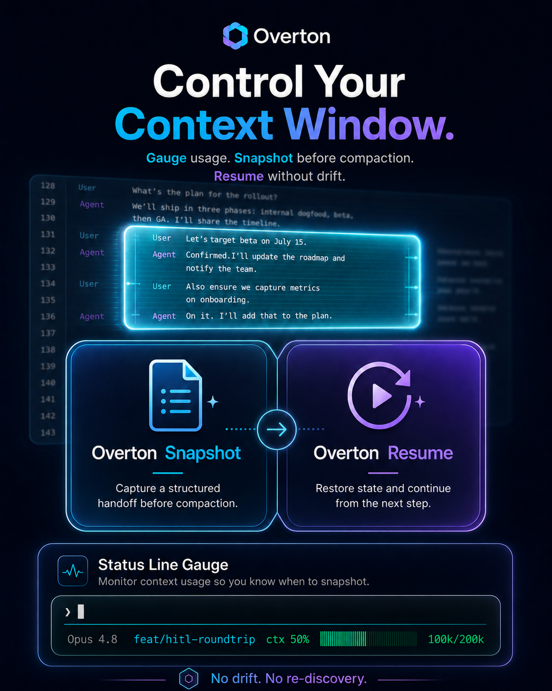
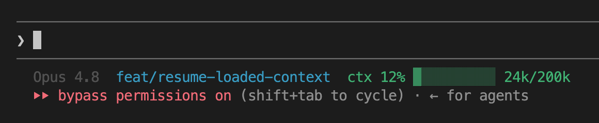
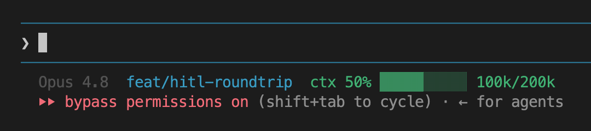
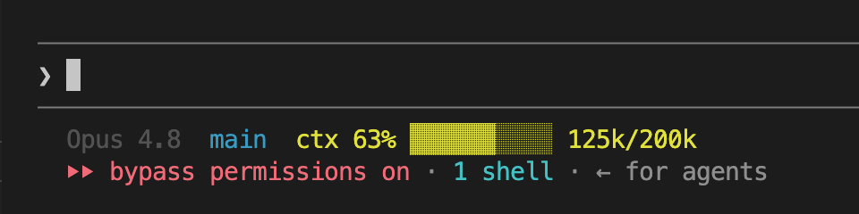
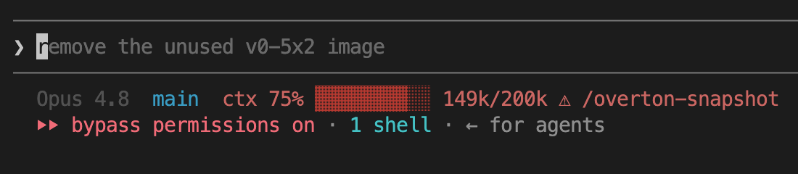
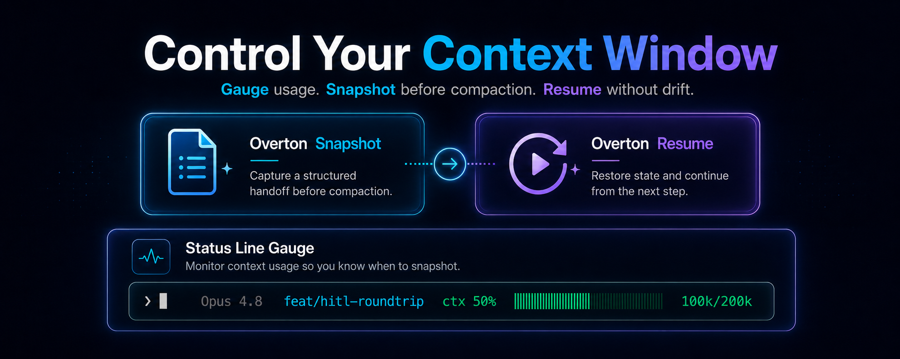

# Overton Snapshot



A Claude Code plugin for the **Overton Context Window** technique: capture a scenario-aware,
structured snapshot of the current session so a **fresh agent with zero prior context** can pick up
exactly where you left off — no drift, no re-discovery. Ships with a context-usage **statusline** and
an over-threshold **nudge** so you know when to snapshot before compaction.

## Why? 

You should always be in charge of the timing and shape of your context window compaction. You should control the *when* and *what*. Waiting for it to fill up and trigger a generic compaction is like waiting for your phone to run out of storage before deciding what to delete — except the phone is an agent trying to help you, and it doesn't know which files are your photos and which are just random downloads.

---

## What's inside


| Component | What it does |
|-----------|--------------|
| `/overton-snapshot` skill | Generates a snapshot using one of 9 scenario templates (coding, planning, debugging, research, strategy, meeting, creative, multimedia, general). Saved as Markdown + YAML frontmatter to `~/.claude/snapshots/`, or into the repo with `--here`. |
| `/overton-resume [path\|substring\|latest]` command | With no arg, **lists** snapshots (from `.claude/handoffs/` → `docs/handoffs/` → `~/.claude/snapshots/`) to choose from — unless there's only one. Or load directly by path, filename substring, or `latest`. Restates state + next step, then continues. Convenience only — consuming a snapshot needs no plugin. |
| `overton/statusline.py` | Statusline showing model · git branch · `ctx NN% ▓▓░ used/window`. Mirrors Claude Code's `/context` (auto-detects 200k vs 1M). Turns red + shows `⚠ /overton-snapshot` over your threshold. |
| `overton/threshold-nudge.py` (Stop hook) | One nudge per rising 10% band per session once you cross the threshold. |
| `overton/config.json` | `threshold_pct` (default 75) and `context_window` (`"auto"`). |






---

## Install (plugin marketplace)

```
/plugin marketplace add reUrgency/Overton-Snapshot
/plugin install overton-snapshot@cc-plugins-by-reurgency
```

### Status line (one-time settings step)

**IMPORTANT:** Only if you want the status line to appear in your Claude interface. 
Plugins can't register a status line directly, so add this once to `~/.claude/settings.json`:

```json
"statusLine": {
  "type": "command",
  "command": "python3 \"$HOME/.claude/overton-statusline.py\""
}
```

The plugin's `SessionStart` hook keeps `~/.claude/overton-statusline.py` pointed at the current plugin
version automatically, so this survives updates.

---

## Usage

### Capture — `/overton-snapshot`

| Command | What it does |
|---------|--------------|
| `/overton-snapshot` | Auto-detects the best-fit template from the session and saves a snapshot to `~/.claude/snapshots/`. |
| `/overton-snapshot 3` | **Template type only.** A leading digit `1`–`9` forces a template instead of auto-detecting. `1`=coding · `2`=planning · `3`=debugging · `4`=research · `5`=strategy · `6`=meeting · `7`=creative · `8`=multimedia · `9`=general. |
| `/overton-snapshot 3 focus on the failing auth test` | **Template + focus comment.** Uses template `3` (debugging) *and* captures the auth-test thread at the highest fidelity. |
| `/overton-snapshot focus on the deploy decision` | **Focus comment only.** No leading digit → template is auto-detected, but your focus is emphasized in the snapshot. |
| `/overton-snapshot --here` | Add **`--here`** to any of the above to write the snapshot **into the current repo** — `./.claude/handoffs/` (or `./docs/handoffs/` if `.claude/` is git-ignored) — using repo-relative paths so it can be committed and a teammate's links still resolve. Without `--here`, snapshots go to the global `~/.claude/snapshots/`. |

> Arguments are flexible: a leading digit `1`–`9` (if present) picks the template, `--here` anywhere sets the destination, and everything else is treated as focus instructions. The command always announces the chosen template and destination before writing.

### Resume — `/overton-resume`

| Command | What it does |
|---------|--------------|
| `/overton-resume` | **No path supplied? It finds snapshots for you.** See below — this is the non-obvious one. |
| `/overton-resume latest` | Loads the single most-recent snapshot immediately, no prompt. |
| `/overton-resume auth-bug` | Treats the text as a **filename substring**: one match loads it, several show the picker, none stops with a message. |
| `/overton-resume ~/.claude/snapshots/2026-06-01-…md` | Loads an **exact file** by path (anything containing `/`, ending in `.md`, or starting with `~`). |

**What happens when you just press Enter on `/overton-resume`** (no argument) — this isn't obvious: it does **not** silently grab the newest file. It scans `./.claude/handoffs/` → `./docs/handoffs/` → `~/.claude/snapshots/` (newest first). If exactly one snapshot exists it loads it; if several exist, it prints a numbered list and waits for you to choose:

```
Found 3 snapshots (newest first):
  1.  2026-06-01 · coding   · Overton-Snapshot plugin build     (./.claude/handoffs/)
  2.  2026-05-31 · strategy · CC campaign prelaunch             (~/.claude/snapshots/)
  3.  2026-05-30 · planning · Snapshot format decision          (~/.claude/snapshots/)

Reply with a number (or a path/substring) to load one.
```

Pick a number and it loads that snapshot, restates the state + next step, and **asks before acting** — it won't start changing things on its own.

---

## Handoffs

A snapshot is plain Markdown — **producing** one needs this plugin; **consuming** one does not.

**Same machine, new session** (e.g. moving a session to a fresh window):
1. `/overton-snapshot` here → note the saved path.
2. In the new session: `/overton-resume` (lists snapshots to pick from, or auto-loads if there's only
   one), `/overton-resume latest`, `/overton-resume <path-or-substring>`, or simply
   *"Read `<path>` and continue."*

**Hand off to a teammate via the repo:**
1. `/overton-snapshot --here` — writes into `./.claude/handoffs/` (falls back to `./docs/handoffs/` if
   `.claude/` is git-ignored) using **repo-relative paths** so links resolve on their machine.
2. **Review for secrets**, then `git add` + commit + push the handoff file.
3. Teammate pulls, opens Claude in the repo, and runs `/overton-resume` (picks from the list, or the
   one handoff) — or, with no plugin installed, just *"Read `.claude/handoffs/<file>.md` and continue."*

`/overton-resume` restates the loaded state and the next step, then asks before acting — it won't
silently start changing things.

---

## Configuration

Edit `overton/config.json` (or set env vars `OVERTON_THRESHOLD_PCT`, `OVERTON_CONTEXT_WINDOW`):

- **`threshold_pct`** — when the indicator turns red and the nudge fires (default `75`).
- **`context_window`** — `"auto"` detects 200k vs 1M from `CLAUDE_CODE_DISABLE_1M_CONTEXT`; or force an integer.

---

## Local development

```
sh bin/dev-link.sh        # symlink ~/.claude at this repo; edits are immediately live
# iterate, then:
/reload-plugins           # (only needed when testing as an installed plugin)
```

`bin/dev-link.sh` never clobbers a real (non-symlink) file in `~/.claude` — it only replaces existing
symlinks, so it's safe to re-run.

---

## Why compaction templates?



We all know how an agent performs better if you give it a specific role, which begins to steer it and  triggers inference to a particular area of its training data. 

Well, guess who's doing your compaction? Your agent. So when you give it a specific template, it begins to steer the agent to be aware of a particular conversation pattern. 

Traditionally when context fills up, the default move is **generic compaction** that squashes the whole
conversation into one generic summary. That's lossy in the worst way. It compresses *uniformly*, with no idea
which details are central **your** task. For example:
* the exact next step
* a specific constraint 
* the approach you already ruled out  
These get paraphrased or dropped right alongside the small talk, because a generic summarizer has no priority function.

A **scenario template is that priority function.** It encodes, up front, what actually matters for a
kind of work:

- A **debugging** snapshot front-loads the repro, the failing assertion, and what's already been ruled
  out — so the next agent doesn't re-walk dead ends.
- A **planning** snapshot preserves the options weighed *and* the decision (with rejected
  alternatives), so a settled question doesn't get re-litigated.
- A **coding** snapshot keeps `path:line` anchors, the diff/working state, and the single next step.

That makes the compression both **more efficient and more accurate**:

- **Higher signal per token.** The token budget goes to the fields that reconstruct working state, not
  to conversational filler — so a fresh agent rebuilds your mental model faster and takes fewer wrong
  turns. No re-discovery, no re-reading the whole thread.
- **Fixed slots force completeness.** The template explicitly asks for intent, constraints, current
  state, and the next step; a section that genuinely doesn't apply is marked `n/a` rather than silently
  vanishing. Generic summaries have no such checklist, so omissions stay invisible until they bite.
- **Verbatim where it counts.** Intent, constraints, and the next step are captured word-for-word, not
  paraphrased — avoiding the most common summarization failure: a subtly reworded instruction that
  quietly changes meaning.
- **Predictable structure.** Every snapshot of a given type has the same shape, so the reader — you, a
  teammate, or a zero-context agent — knows exactly where to look.

In short: generic compaction asks *"what was said?"* A template asks *"what does the next agent need to
continue?"* — and spends the limited token budget optimizing for that answer.

---

## How context usage is computed

Claude Code doesn't expose context size to status lines/hooks, so it's derived from the session
transcript (`.jsonl`): the **last assistant turn's** token usage (`input + cache_creation + cache_read`),
using the **last `iterations[]` entry** to avoid double-counting multi-pass turns. The window divisor
matches Claude Code's own `/context` gauge (200k target when `CLAUDE_CODE_DISABLE_1M_CONTEXT` is set,
else 1M), and values over 100% are shown deliberately — they mean you're over your target window.

Before the first turn writes any usage (a brand-new session, or right after a `/resume`), the figure is
**estimated** from transcript content — system/tools baseline plus the messages that will replay (from the
last compaction summary onward for continued sessions) — and shown with a leading `~` (e.g. `ctx ~18%`).
The exact number replaces the estimate as soon as the first turn completes.

---

## License

MIT © reUrgency
